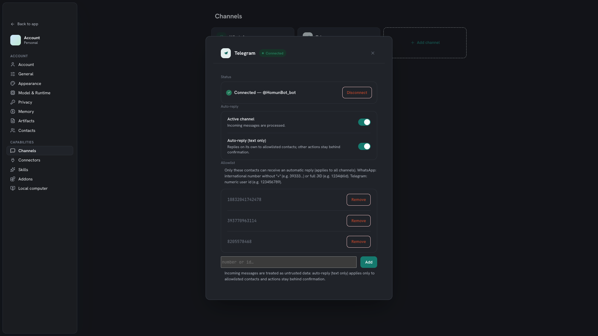

Channels connect your messaging apps to Homun so conversations flow into memory and
the assistant can help you reply — without ever sending something behind your back.

## Supported

- **WhatsApp**
- **Telegram** (via a Bot API sidecar)

Both reuse the same channel pipeline, so they behave consistently.

*Connect channels from Settings — each shows its status; here WhatsApp is linked and Telegram isn't yet.*

## Connect WhatsApp

WhatsApp links as a **companion device** of your own account (like WhatsApp Web).

1. **Settings → Channels → WhatsApp → Connect**.
2. Link it from your phone, either way Homun offers:
   - **Scan the QR** — on your phone: **WhatsApp → Settings → Linked devices → Link a device**.
   - or **pair by phone number** — pick *Link with phone number* on your phone and enter the code Homun shows.
3. When the handshake completes the card flips to **Connected**.

Because it's your real account, inbound messages flow into [memory](/guides/memory/) and
drafts — always under the allowlist + approval gate below.

## Connect Telegram

Telegram is different: Homun connects through a **bot you create**, not your personal
account. That's a couple of extra steps, but it means full control and no phone pairing.

1. In Telegram, open a chat with **[@BotFather](https://t.me/BotFather)**.
2. Send `/newbot` and follow the prompts: a **display name**, then a **username** that
   must end in `bot` (e.g. `my_assistant_bot`).
3. BotFather replies with an **API token** like `123456789:AAE…`. Copy it.
4. In Homun: **Settings → Channels → Telegram → Connect**, paste the token, press
   **Connect**. Once verified the card shows **Connected — @your_bot**.
5. To reach your assistant, **message that bot directly** in Telegram.

:::note
A Telegram **bot only sees messages sent to it** — direct chats with the bot, or groups
where it's added. It can't read your other Telegram conversations (that's by Telegram's
design, not a limit of Homun). The token is saved server-side, so reconnecting later
just needs **Connect** — no re-entry.
:::

## Inbound

When a message arrives, Homun routes it through the pipeline: it can extract what
matters into [memory](/guides/memory/) (people, facts, decisions) and prepare a
**draft reply** for you to review.

## Auto-reply, gated

Automatic replies are **opt-in and gated**:

- An **allowlist** decides who can ever receive an automatic reply.
- An **approval** step lets you confirm before a message goes out.

Deny-by-default is the rule — see [Privacy & security](/guides/security/). Nothing is
sent unless you've allowed that contact and (where configured) approved the message.

## Pair with automations

Because an incoming message is an event, a channel can **trigger** an
[automation](/guides/automations/) — for example, "when a message from X arrives, draft
a reply and notify me."
