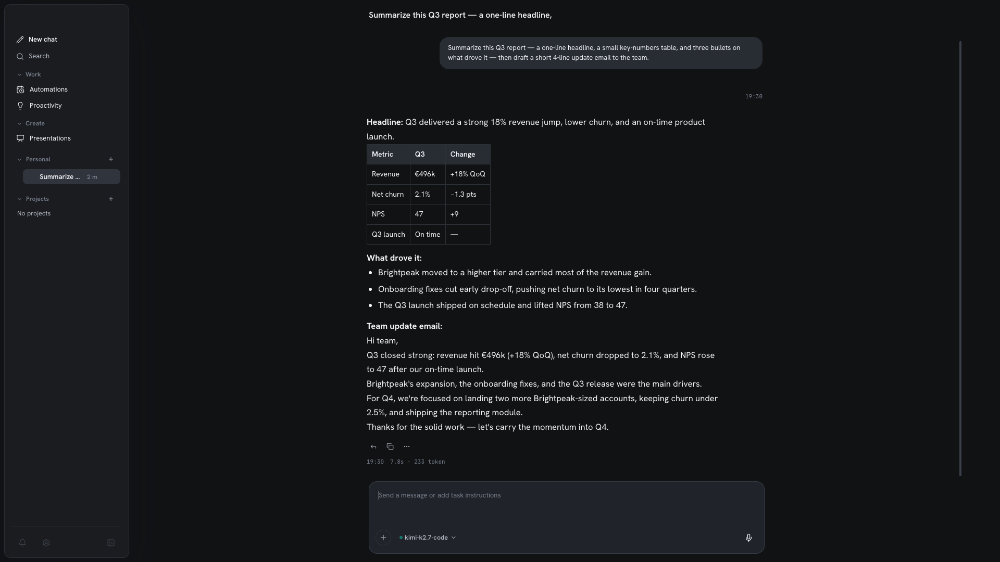

Chat is the foundation of Homun. Everything else — tasks, memory, the browser — is
layered *beneath* it, surfacing as inline activity rather than cluttering the
conversation. The goal is a simple, stable chat that never stalls.

*A reply rendered with Markdown, inline code, and a code block — streamed live.*

## Rich responses

Replies render full **Markdown**: headings, lists, tables, blockquotes, and **code
blocks with syntax highlighting**. Diagrams and structured content render inline, so a
plan or a comparison reads as a document, not a wall of text.

Responses **stream** token-by-token, and you can **cancel** a generation mid-flight.
Switch to another thread while a reply keeps generating in the background — the
gateway runs several independent workers, so one slow answer never blocks the rest
(see [Models & providers](/guides/models/) for the concurrency model).

## Attachments & vision

Drop in files and images. With a vision-capable model, Homun reads screenshots,
photos, and documents directly in the conversation — useful for "what's wrong in this
error screenshot?" or "summarize this PDF."

## Artifacts

Files the assistant creates or edits land in a **workspace** as **artifacts** you can
open, **version**, and re-use across the conversation — not buried in a code block you
have to copy out by hand.

## Message actions

You're not stuck with the transcript as-is:

- **Edit** a message and re-run from that point.
- **Branch** — editing forks the conversation, so you can explore an alternative
  without losing the original. Each branch keeps its own history.
- **Save a reply to memory**, or turn it into a task or automation, from the actions
  under each message.
- Organize threads into **folders** and **projects/workspaces**.

## Per-message model

Each message can override the model. Leave it on automatic and the router picks per
task, or pin a specific model for one reply — handy to send a hard question to a
stronger cloud model while everyday chat stays local. See
[Models & providers](/guides/models/).

## Inline activity

When a reply triggers real work — a [task](/reference/architecture/), a browser
session, an approval — it shows up as an **activity card** inside the chat: a timeline
with progress, previews/thumbnails, and approve/takeover controls.

This is *progressive disclosure*: the base chat stays clean, and the operative detail
is one glance away when you want it. The
[contained computer](/guides/local-computer/) appears the same way, with a live view
you can watch and take over.

:::note
Heavy capabilities — task runtime, browser, approvals, memory, subagents — never
appear as default chat behavior. They show up as a card only when a turn actually uses
them. The base loop stays *write → respond → understand*.
:::

## Languages

Homun is multilingual. The interface ships in English and Italian, and replies follow
**your** language automatically — you write in yours, the assistant answers in yours.
System prompts run in English under the hood; only the output is localized.
