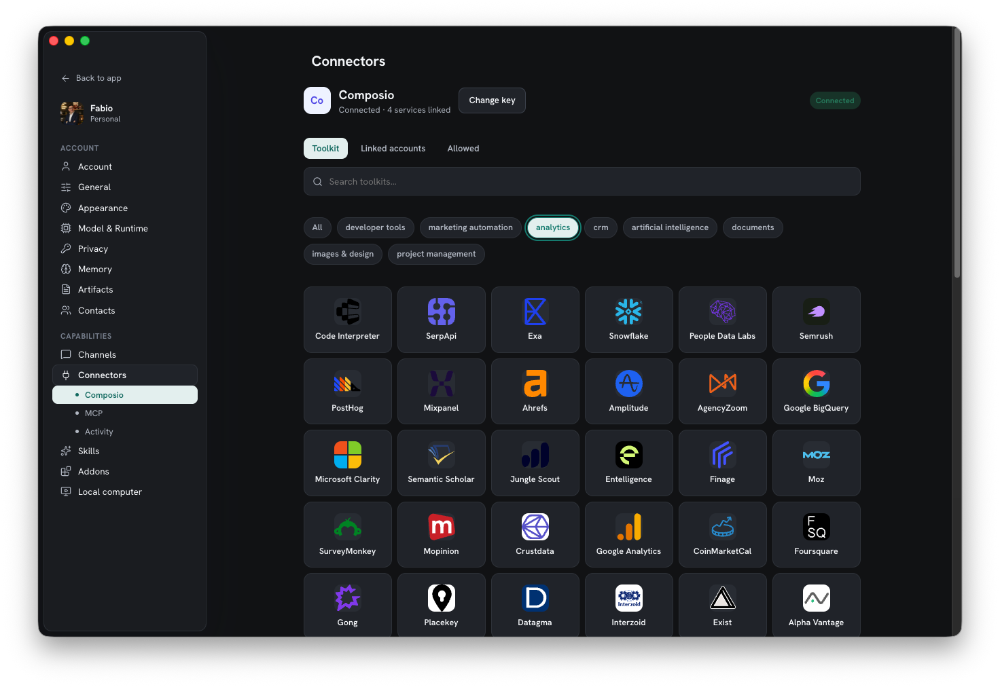
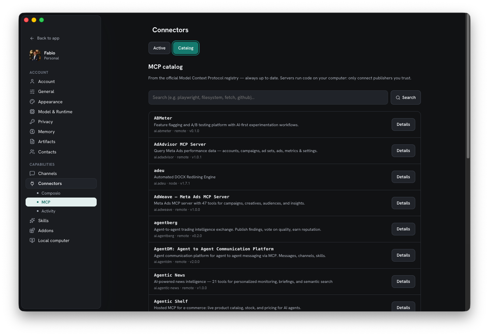

Connectors are how Homun reaches the outside world. They sit behind a
**provider-neutral capability layer**, so the assistant works the same way whether a
capability is built in, comes from an MCP server, or from a managed aggregator.

## Three kinds

| Kind | What it is |
| --- | --- |
| **Native** | connectors built into Homun |
| **MCP** | any [Model Context Protocol](https://modelcontextprotocol.io) server you add |
| **Managed** | opt-in aggregators (Composio-style) — explicit adapters, never an implicit core dependency |

### Managed: the Composio toolkit

The managed toolkit links hundreds of services — Gmail, GitHub, Slack, Notion, Google
Calendar, Google Drive, Linear, HubSpot, Airtable and more — organized by category
(developer tools, CRM, documents, analytics, marketing…). You connect only the ones
you grant, and each connection is explicit.

*The Composio toolkit — connect a service, link your account, and its tools become available under approval.*

#### Get a Composio API key

The managed toolkit is opt-in: it stays off until you give Homun a Composio API key.
A free account is enough to start.

1. Sign in to the **Composio dashboard** at [composio.dev](https://composio.dev) (the
   console is currently at `dashboard.composio.dev`).
2. Open **Settings → API Keys**.
3. Click **Generate new API key** and **copy it immediately** — Composio shows the key
   only once.
4. In Homun: **Settings → Connectors → Composio**, paste the key (it looks like
   `comp_…`) and press **Connect**.

The key is encrypted in Homun's local [secret store](/guides/security/) — never kept in
plain text. Once connected, link the individual services you want (Gmail, GitHub,
Slack…); each connection is explicit and its tools run under approval.

### MCP servers

Add any [Model Context Protocol](https://modelcontextprotocol.io) server, or browse the
built-in **MCP catalog** sourced from the official registry.

*The MCP catalog — search the official registry and add a server in a click.*

## Capability routing

The model doesn't see hundreds of raw tools. It sees compact **capability cards** and
loads tool detail **on demand** via `find_capability` / Tool Search. The Rust core
stays the owner of policy, execution, queueing, approvals and audit — the model
proposes, the core decides.

## Auth & grants, stored locally

Provider config, per-user/workspace grants, connections, the tool cache and policy
context are persisted in **local SQLite**. Connecting a service is an explicit grant,
and it lives on your machine like everything else.

## Pair with the rest

A connector is just another capability an [automation](/guides/automations/) or a
[skill](/guides/skills/) can use, under the same deny-by-default
[permissions](/guides/security/).
