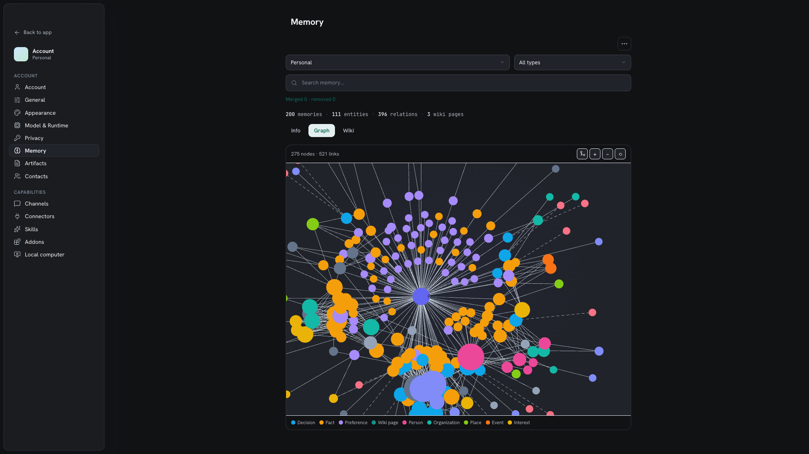
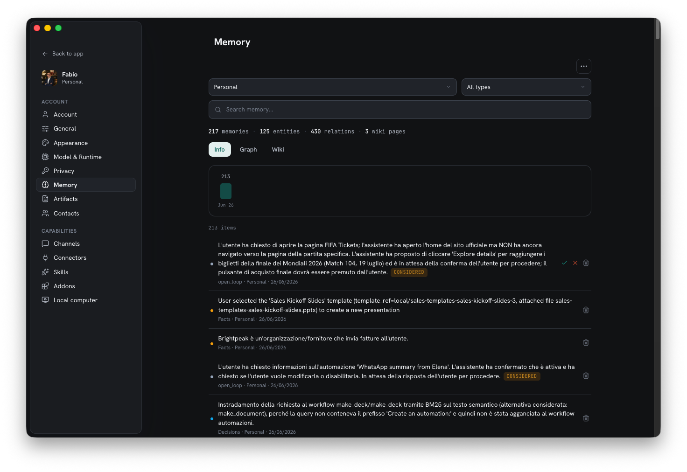

Most assistants forget you between sessions, or remember you in an opaque cloud. Homun
builds a **private, verifiable memory** that lives on your machine and that you can
read and correct.

*The memory graph — entities and relationships, filterable by type (facts, decisions, preferences, conversations).*

## How it's stored

Memory is **hybrid**, not a single embedding blob:

| Layer | Role |
| --- | --- |
| **SQLite** | the durable backing store for everything below |
| **Graph** | entities, relationships, and decisions, linked over time |
| **Markdown wiki** | a human-readable wiki generated from the graph |
| **Contacts** | a curated set of people, kept separate from raw chat history |

## From conversation to knowledge

As you talk, Homun **extracts** what matters and links it into the graph:

- **Entities** — people, projects, places, organizations, events.
- **Relationships** — how those entities connect.
- **Decisions** — choices worth remembering, with their context.

Over time it **consolidates**: fragments about the same entity are merged and noise is
removed, so the picture sharpens instead of duplicating. An **event log** records what
was learned and when, so memory has history, not just a current state.

## Transparent and correctable

Because memory is an inspectable graph plus a wiki — not a black box — you can see
exactly what was learned and fix anything wrong. This is a core
[principle](/concepts/): the assistant's knowledge is yours to audit, edit, and trust.

*The same memory as a readable list — consolidate fragments or export it all.*

## Forget

You can **forget** by **topic or entity**. Removing an entity removes what hangs off
it, so "forget everything about project X" is a real, scoped operation — backed by
cascade purge in the database, not a hope that the model drops it.

## Contacts

People you interact with — including through [channels](/guides/channels/) — can be
curated as **contacts**: a clean address book the assistant draws on, distinct from the
firehose of message history.

## Stays local, and exportable

Nothing in memory leaves the machine by default — plain SQLite + files under
`~/.homun` (desktop) or your mounted volume (server). You can **export** your data at
any time, and retention is enforced (cascade purge + VACUUM) so deletions are real.
See [Privacy & security](/guides/security/).

## Related: Graphify

For code and project work, **Graphify** builds a graph of a codebase or project on the
host — the same idea applied to a repository: a navigable structure instead of a flat
pile of files.
