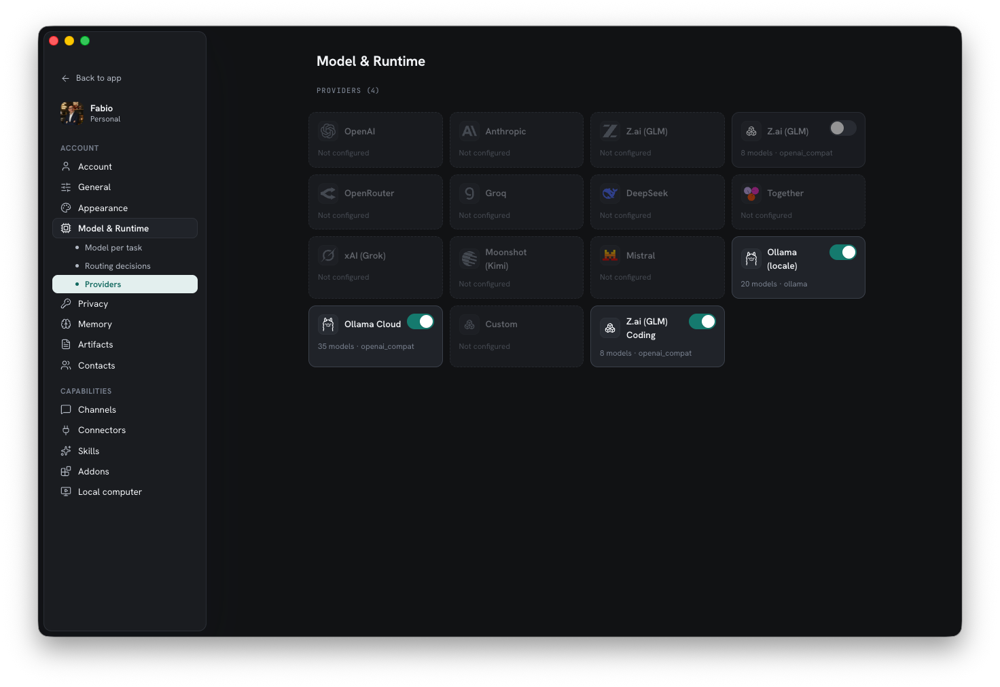
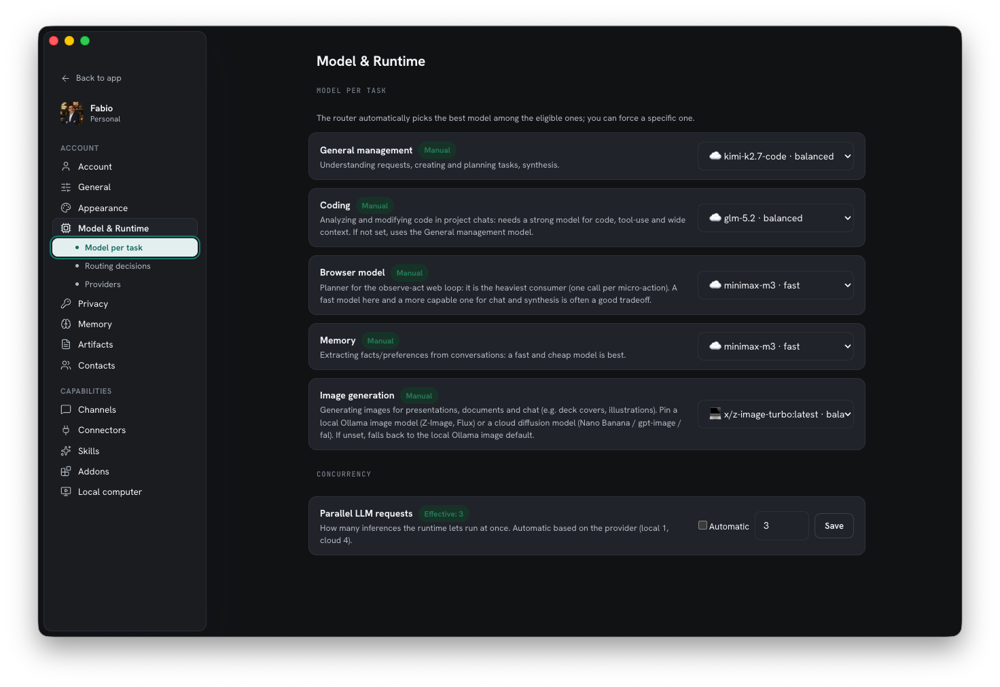

Homun has no single hard-coded model. You connect one or more **providers**, enable
the ones you want, and a router picks the right model for each task. Local-first is
the default; cloud is opt-in.

## Provider kinds

Under the hood there are three transport kinds. Everything else is built on them:

| Kind | What it is | Examples |
| --- | --- | --- |
| `ollama` | a local Ollama server — fully offline | Ollama (local) |
| `openai_compat` | any endpoint speaking the OpenAI API | OpenAI, Groq, OpenRouter, … |
| `anthropic` | the Anthropic Messages API (Claude) | Anthropic |

Because most of the industry speaks the OpenAI protocol, a single `openai_compat`
provider covers a huge range of services.

## One-click presets

The Providers screen shows the **whole catalog at once**, each with its real logo.
Configured providers are in colour with an enable toggle; the rest are greyed — click
any greyed one to configure it (the base URL is filled in for you; you just add a key
and pick a model):

| Provider | Kind | Notes |
| --- | --- | --- |
| **Ollama (local)** | `ollama` | the default, fully offline |
| **Ollama Cloud** | `openai_compat` | `:cloud` models; key from ollama.com |
| **OpenAI** | `openai_compat` | |
| **Anthropic** | `anthropic` | Claude — the premium cloud path |
| **Z.ai (GLM)** | `openai_compat` | GLM-5 |
| **OpenRouter** | `openai_compat` | many models behind one key |
| **Groq** | `openai_compat` | fast inference |
| **DeepSeek** | `openai_compat` | |
| **Together** | `openai_compat` | |
| **xAI (Grok)** | `openai_compat` | |
| **Moonshot (Kimi)** | `openai_compat` | |
| **Mistral** | `openai_compat` | |
| **Custom** | `openai_compat` | any other OpenAI-compatible endpoint |

:::note
Don't see your provider? Pick **Custom**, paste its OpenAI-compatible base URL and
key, and it works like the rest. The list above is convenience, not a limit.
:::

*The full catalogue, each with its real logo: configured providers in colour with an enable toggle, the rest greyed — click any to configure it.*

## Enable / disable per provider

A configured provider has an independent **on/off** switch. Enable several at once —
the router only ever chooses among the *enabled* ones. Turning a provider off removes
its models from routing without deleting its configuration. Providers you haven't set
up yet stay greyed with no toggle until you add a key.

## The model registry

Every model carries metadata the router reasons about: **tool support**, **vision**,
**reasoning**, **context window**, and **tier**. That's how Homun knows a small local
model can handle a quick reply while a vision request needs a vision-capable model.
Homun can refresh a provider's model list and auto-generate these profiles.

## Routing: role → model

Work is organized by **role** — **General management** (understanding requests,
planning, synthesis), **Coding**, **Browser model** (the observe-act web loop, the
heaviest consumer), and **Memory** (fast, cheap fact extraction). The router resolves
each role to a model:

- **Automatically**, by matching the role's needs against the registry, or
- **Explicitly**, with a binding you set in Settings.

You can also override the model **per message** in [chat](/guides/chat/) — pin one
reply to a stronger model without changing your defaults.

*Per-task routing: a different model for management, coding, browser, and memory — automatic, or pinned by you.*

## Local-first by default

Local models via Ollama stay the default; cloud providers are an explicit opt-in. You
decide where each kind of work runs, and you can keep everything on the machine.

## Concurrency

Throughput adapts to the active provider. The **ResourceGovernor** sets how many
inference requests run in parallel:

- **Auto** follows locality — **1** for a local/loopback provider, **4** for cloud.
- You can **force** a value: raise it for Ollama on a big GPU, or lower it to cap
  cloud spend.

The gateway spawns several independent workers; the governor does the real gating, so
you can start work in one thread and switch to another while it runs.

## Structured output stays validated

For operative outputs — a plan, a memory write, a risk assessment — the model must
produce **structured, contract-validated** output. The Rust core validates the JSON
before acting, so a malformed or unsafe response is caught rather than executed.

## Set it up

Open **Settings → Model & runtime** to add a provider (pick a preset or Custom, paste
the key), refresh its models, and bind roles. On a server, providers are configured
via environment variables instead — see [Self-hosting](/guides/self-hosting/).
