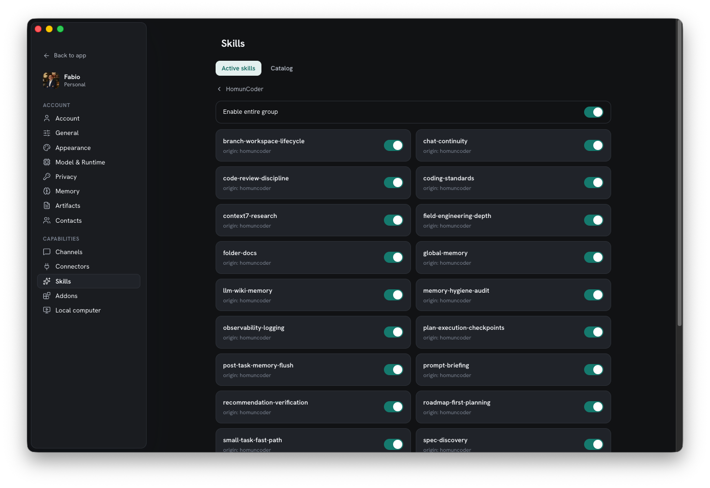
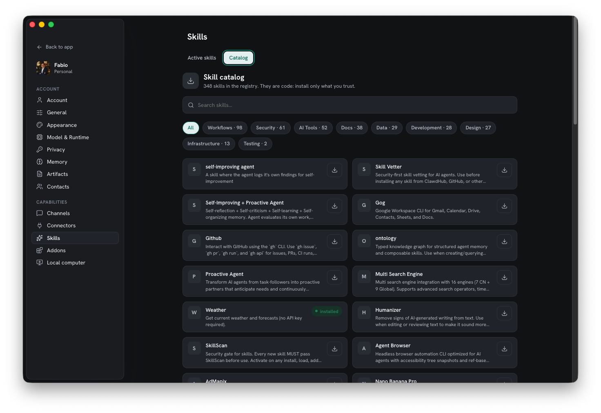

A **skill** is a packaged capability the assistant can use. Homun discovers the ones
you already have, lets you install more from a catalog, and runs them in a sandbox.

## Local skills

Homun **scans** for skills present on your machine and lists them, so what's installed
is always visible — no hidden capabilities.

*Active skills — your own, always on, plus the HomunCoder pack that ships by default.*

## The catalog

Browse and install from the **OpenClaw / ClawHub catalog**: searchable, organized by
category. Each catalog entry has a **security scan** in its detail view, so you can
see what a skill does before installing it.

The **HomunCoder** methodology skills ship by default.

*The catalog — searchable, categorized, each entry installable with a security scan in its detail view.*

## Sandboxed execution

Skills run inside the [contained computer](/guides/local-computer/) — a Docker sandbox
with a shell and toolchain — not directly on your host. Combined with deny-by-default
[permissions](/guides/security/), an installed skill can't quietly reach beyond what
you've granted.

## Manage them

The **Skills** section in Settings shows active skills and the catalog, with a toggle
to enable or disable each one — part of the broader
[addon ecosystem](/reference/architecture/).
