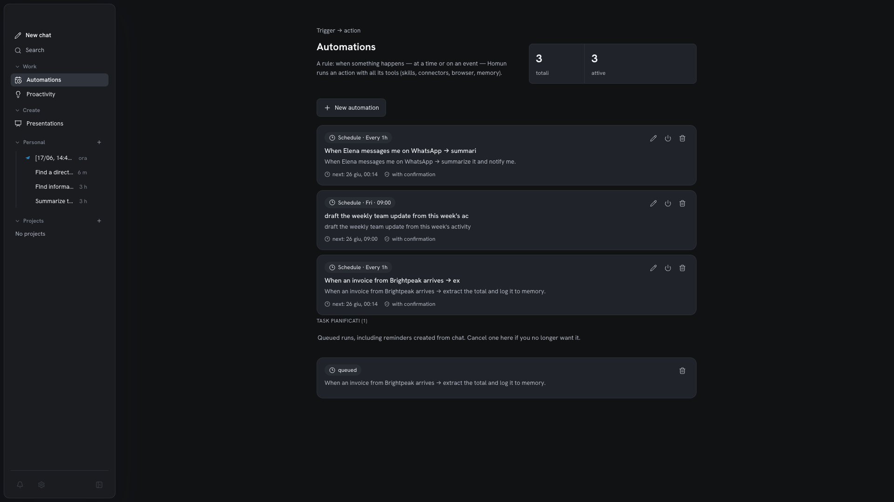

Un'automazione è una semplice regola con due metà:

```text
Quando <trigger>  →  Allora <azione>
```

Il trigger scatta; l'azione gira come un [task](/it/reference/architecture/) agentico
completo con tutto il toolset.


*Costruire una regola: scegli una pianificazione o un evento, descrivi l'azione e richiedi conferma prima che venga inviato qualcosa.*

## Trigger

- **A tempo** — una pianificazione (es. ogni mattina, ogni ora).
- **A evento** — succede qualcosa: un messaggio da un [canale](/it/guides/channels/),
  un segnale da un servizio connesso.

## Azioni

L'azione è un **task agentico**, non uno script fisso. Ha accesso alle stesse capacità
dell'assistente: [skill](/it/guides/skills/), [connettori](/it/guides/connectors/), il
[computer contenuto](/it/guides/local-computer/) e la [memoria](/it/guides/memory/).
Così "riassumi i miei messaggi non letti e archivia quelli importanti" è un'unica regola,
non una pipeline da cablare a mano.

## Durevole per design

Le automazioni girano sul durable task runtime: i task sopravvivono ai riavvii grazie a
un heartbeat watchdog (rinnovo del lease + guardia contro la doppia esecuzione).
Un'azione pianificata non gira due volte in silenzio né svanisce se l'app si riavvia a
metà.

## Da un suggerimento

Raramente parti da una regola vuota. Il motore di [proattività](/it/guides/proactivity/)
di Homun individua il lavoro ricorrente e offre una card di suggerimento; accettarla crea
l'automazione.
