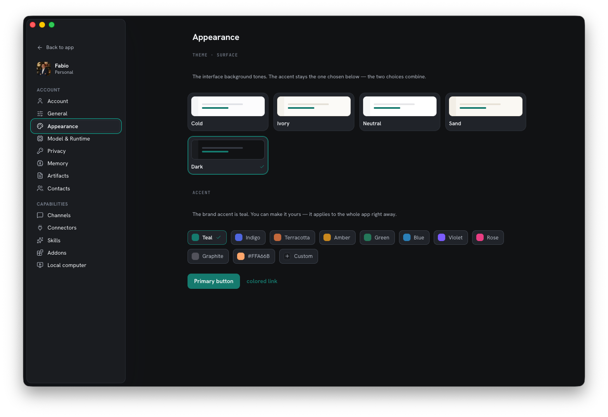

Il modo più rapido per provare Homun è l'**app desktop**. Per eseguirla su un server,
vedi [Self-hosting](/it/guides/self-hosting/).

## Installazione (macOS)

1. Scarica l'ultimo `.dmg` dalla [pagina delle release](https://github.com/homun-app/homun-releases/releases/latest).
2. Aprilo e trascina **Homun** in `Applicazioni`.
3. Avvialo. La build è firmata e notarizzata, quindi si apre senza l'avviso di
   Gatekeeper.

L'app include il proprio backend (un piccolo gateway nativo) — non c'è altro da
installare.

## Primo avvio

1. **Scegli un provider di modelli.** Punta Homun su un [Ollama](https://ollama.com)
   locale o sull'API di un provider cloud. Puoi abilitarne diversi insieme; ogni
   provider ha un interruttore on/off e il router sceglie il modello giusto per ogni
   compito.
2. **Saluta.** Avvia una chat. Homun costruisce una memoria privata mentre parli —
   ciò che impara resta in `~/.homun` sulla tua macchina.

## Rendilo tuo

In **Impostazioni → Aspetto** puoi scegliere una superficie dell'interfaccia (Cold,
Ivory, Neutral, Sand) e un accento del brand. L'accento predefinito è il **teal**, ma
puoi cambiarlo — si applica subito a tutta l'app.

*Toni della superficie più un accento a un clic — teal di default, tuo da cambiare.*

## Il computer locale (opzionale)

Per i task che richiedono un vero browser o una shell, Homun esegue un **computer
contenuto** — un container Docker in sandbox che controlla. Serve Docker in esecuzione
in locale (Docker Desktop, OrbStack o Colima). Abilitalo dalla campanella nel menù
laterale o dalla sezione **Computer locale** nelle Impostazioni; puoi guardare la
sessione dal vivo nella chat.

## Aggiornamenti

L'app desktop si aggiorna da sola: quando esce una versione più recente, il pannello
**Notifiche** (la campanella nel menù laterale) mostra un **scarica + riavvia** a un
clic.

## Avanti

- [Self-hosting](/it/guides/self-hosting/) — esegui la stessa app come container tuo.
- [Architettura](/it/reference/architecture/) — cosa c'è sotto il cofano.
