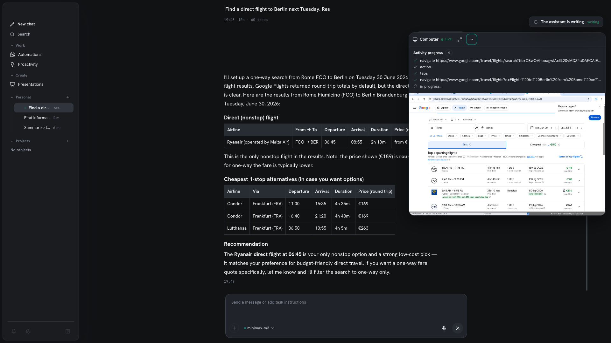

Per i task che devono *fare* cose — aprire un sito, compilare un form, eseguire un
comando — Homun guida un **computer contenuto**: un container Docker in sandbox con un
vero browser headed e una shell. È isolato dal tuo host, e puoi guardarlo lavorare.

*Il computer contenuto: un vero browser trasmesso dal vivo via noVNC, in esecuzione in un container Docker che puoi fermare quando vuoi.*

## Cosa c'è dentro

- Un **vero browser**, guidato via CDP (Chrome DevTools Protocol).
- Una **shell + toolchain**, usata per eseguire [skill](/it/guides/skills/) e comandi.
- Una **vista dal vivo** (noVNC) trasmessa nella chat.

## Guarda e prendi il controllo

La sessione compare come una [card di attività](/it/guides/chat/) inline: una timeline
con progresso, anteprime e controlli. Puoi **guardarla dal vivo** e **prendere il
controllo** quando vuoi guidare a mano — l'agente opera sotto approvazioni, non
incustodito.

## Sfide e captcha

L'agente gestisce da solo le verifiche umane semplici — un pulsante **tieni premuto**
("press and hold"), una checkbox, uno slider — guidando il puntatore reale come farebbe
una persona.

Per quelle più difficili (griglie di immagini, muri di login) non tira a indovinare:
**passa la mano a te**. Il task si mette in pausa, tu risolvi la sfida nella vista dal
vivo e riprende. E poiché un task lanciato mentre sei via non deve mai restare appeso,
il passaggio di mano ha un **timeout** (default 180s, modificabile con
`HOMUN_BROWSER_HANDOFF_TIMEOUT_SECS`): oltre la scadenza il task molla con grazia, con
un motivo chiaro, invece di aspettare all'infinito.

## Più difficile da rilevare

Il browser è un **Chrome reale, con interfaccia** — non il vecchio headless — con un
**profilo persistente**, così cookie e login sopravvivono tra una sessione e l'altra. I
siti vedono una persona che ritorna anziché un bot appena nato, quindi i captcha
compaiono molto meno spesso. Homun lo guida inoltre tramite uno strato di automazione
irrobustito che evita le tipiche impronte da "controllato da software automatico". Non
esiste invisibilità perfetta (conta anche la reputazione del tuo IP), ma nell'uso
quotidiano incontrerai molti meno muri.

## Requisiti

- **Desktop:** un motore Docker locale (Docker Desktop, OrbStack o Colima). Abilitalo
  dalla campanella nel menù laterale o da **Impostazioni → Computer locale**.
- **Server:** monta il socket Docker dell'host; il gateway costruisce ed esegue il
  container fratello, e fa il reverse-proxy della vista dal vivo attraverso la propria
  origine TLS — nessuna porta VNC esposta. Senza il socket la funzione resta spenta e il
  resto dell'app funziona.

Vedi [Self-hosting](/it/guides/self-hosting/) per la configurazione lato server.

## Contenuto per design

Girare in una sandbox è una scelta di [sicurezza](/it/guides/security/): le azioni reali
dell'agente avvengono in un container con permessi deny-by-default, non direttamente
sulla tua macchina.
