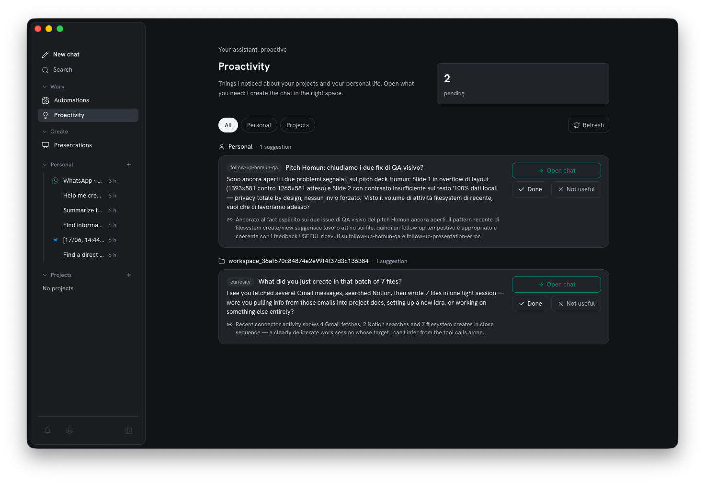
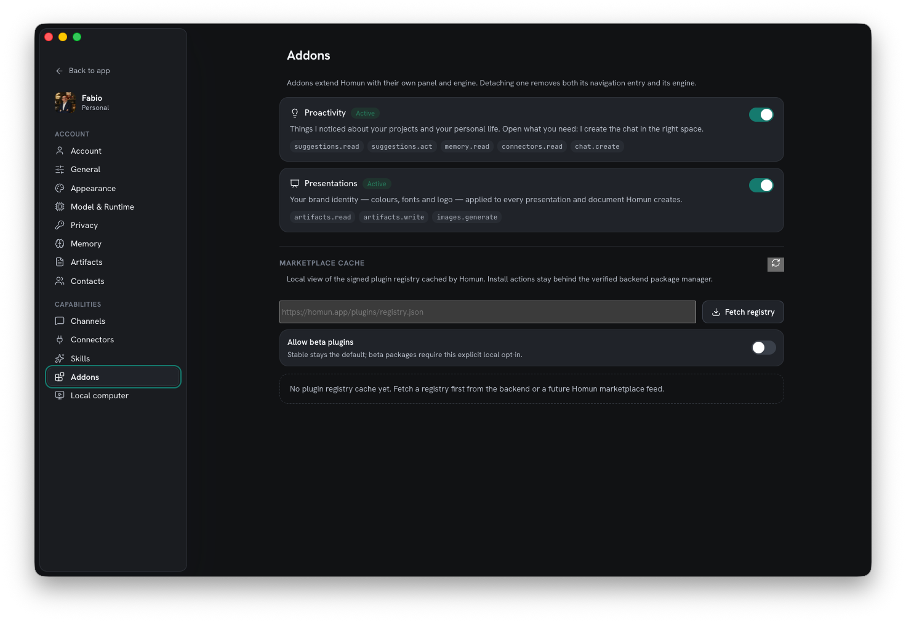

Un buon apprendista non aspetta che gli si dica tutto. Homun esegue un **motore
supervisore** che osserva i pattern nel tuo lavoro e offre aiuto — trasformando
l'osservazione in suggerimenti su cui resti tu a decidere.

*Card di suggerimento — l'assistente propone; tu apri, agisci o scarti. Nulla gira da solo.*

## Card di suggerimento

Quando il motore nota lavoro ricorrente — un task che continui a fare, una routine che
può prendere in carico — fa emergere una **card di suggerimento**. Nulla accade
automaticamente: un suggerimento è un'offerta, non un'azione.

## Dal suggerimento all'automazione

Accetta una card e diventa un'[automazione](/it/guides/automations/) — una regola
`Quando → Allora` che puoi modificare o rimuovere. Rifiutala e sparisce. Decidi tu cosa
l'apprendista può prendere in carico.

## Un addon, con permessi circoscritti

La proattività è essa stessa un **addon** (parte dell'[ecosistema di
addon](/it/reference/architecture/) di Homun): gira come motore e pannello propri e
dichiara esattamente i permessi che usa — leggere i suggerimenti, agire su di essi,
leggere la memoria, leggere i connettori, creare una chat. Staccala e spariscono sia il
suo pannello sia il suo motore.

*La proattività come addon — permessi espliciti, e un singolo interruttore per spegnerla.*

## Silenzioso di default

La proattività vive *sotto* la chat, come il resto della potenza operativa di Homun:
compare come card quando è rilevante, mai come rumore nella conversazione di base. Il
[product loop](/it/concepts/) — scrivi, rispondi, capisci — resta semplice.
