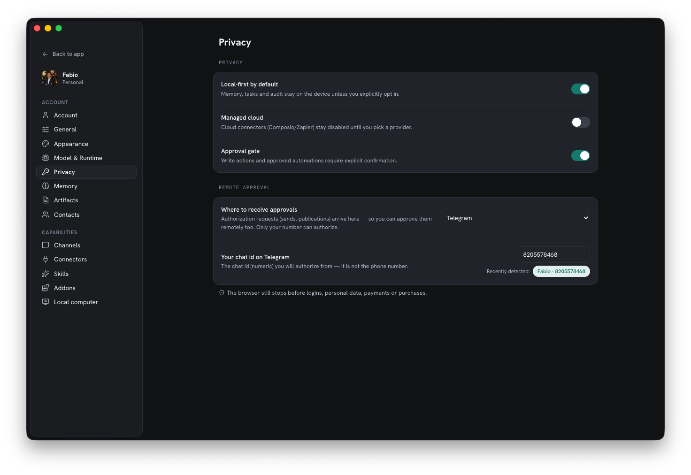

Homun è costruito perché fare cose potenti resti sicuro e privato. I default propendono
per *meno* esposizione, non più.

*Le impostazioni Privacy — local-first attivo, cloud gestito spento e un gate di approvazione, tutto di default.*

## Local-first

I tuoi dati e la tua memoria vivono sul dispositivo per impostazione predefinita —
semplice SQLite + file sotto `~/.homun` (desktop) o un volume che monti (server). I
[modelli](/it/guides/models/) cloud sono una delega opt-in; puoi tenere tutto sulla
macchina.

## Permessi deny-by-default

Le capacità sono spente finché non concesse. [Connettori](/it/guides/connectors/), il
[computer contenuto](/it/guides/local-computer/) e le risposte automatiche dei canali
girano tutti dietro **concessioni esplicite** — non c'è accesso implicito. I connettori
cloud gestiti (stile Composio/Zapier) restano disabilitati finché non scegli un provider.

## Approvazioni e autorizzazione remota

Un **gate di approvazione** richiede conferma esplicita prima che girino azioni di
scrittura e automazioni approvate. Quando l'agente guida il
[computer contenuto](/it/guides/local-computer/), il **browser si ferma prima di login,
dati personali, pagamenti o acquisti** — quelli tornano sempre a te.

Le approvazioni possono raggiungerti **da remoto**: instrada le richieste di
autorizzazione su Telegram così puoi approvare un invio o una pubblicazione dal telefono.
Solo il tuo chat id può autorizzare.

## Contratti e audit

Le azioni operative passano da **contratti**: il modello produce output strutturato (un
piano, una scrittura in memoria, una valutazione del rischio) che il core Rust **valida
prima di agire**. Le azioni sono registrate in un **audit trail**, così ciò che
l'assistente ha fatto è ispezionabile a posteriori.

## Dati a riposo

Il gateway gira con una umask stretta così tutto ciò che scrive è **solo del proprietario
(0600)** — inclusi i file SQLite WAL/SHM creati a runtime. Gli store personali (memoria,
contatti, sessioni dei messaggi) sono SQLite in chiaro protetti dai permessi dei file,
quindi non sono esposti ad altri utenti locali.

## Segreti

Chiavi API e token sono memorizzati in locale (solo del proprietario) e tenuti fuori dai
read model e dai log. Su un server, il gateway richiede un bearer token e serve un gate
di login — il token non è mai incorporato nel bundle web. Vedi
[Self-hosting](/it/guides/self-hosting/).

## Contenimento

L'esecuzione reale avviene dentro il [computer contenuto](/it/guides/local-computer/),
isolato dal tuo host. Insieme ai permessi deny-by-default, un'azione dell'agente non può
raggiungere in silenzio oltre la sua sandbox.

## I tuoi dati, esportabili

Puoi **esportare** i tuoi dati in qualsiasi momento, e la retention è applicata (cascade
purge + VACUUM) così le cancellazioni sono reali, non soft.

## Analisi del sito

Questo sito usa Umami Cloud per misurare visualizzazioni di pagina aggregate e alcune
interazioni selezionate, come i tentativi di download, i link in uscita verso GitHub e
la partecipazione alla roadmap. Le analisi del sito non ricevono dati dell'account
Homun, contenuti degli spazi di lavoro, prompt o file, e Homun non le usa per
identificare i singoli visitatori.

Per informazioni su titolare, fornitore, conservazione e diritti, leggi l'[informativa privacy del sito](/it/privacy/).
